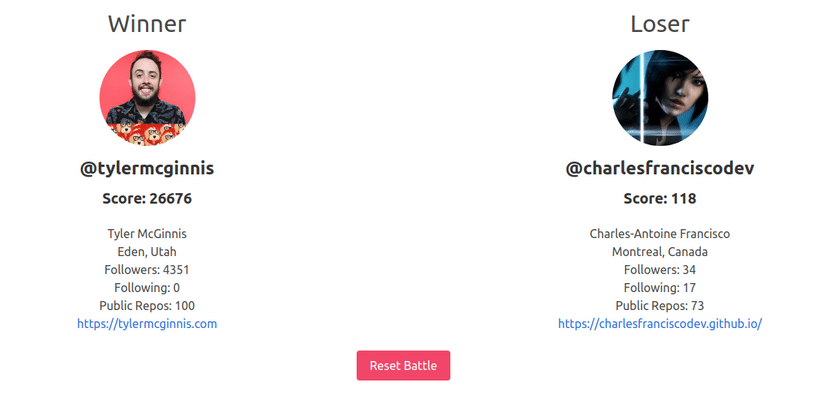
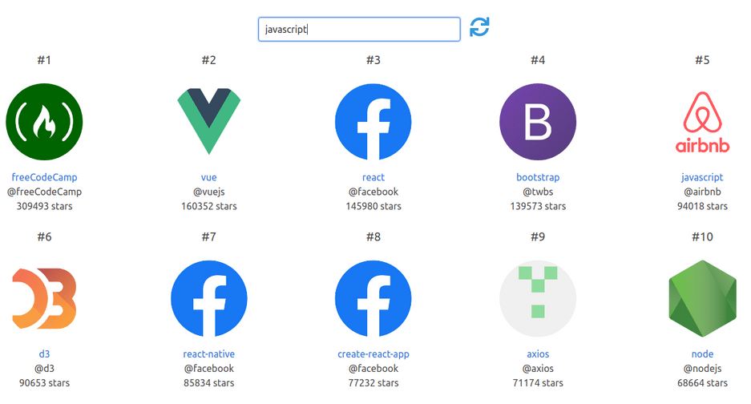

# GitHub Battle

GitHub Battle Clone with Vue.js and GraphQL

## Screenshots

### Battle


### Popular Repos


## Features

### Battle
* Enter in two Github usernames, and it'll declare a winner.
* Validate each username entered with the GitHub API to make sure they exist.
* user score = (3 * nb_followers) + nb_stars_for_his_repos
* show each user's info
  * avatar
  * username
  * full name
  * location
  * followers count
  * following count
  * public repos count
  * blog url

### Popular Repos
* View a list of popular repos.
  * filter by language(s)
    * all languages
    * or type a language (JavaScript, Java, Python, etc.)
  * sort results by stars in descending order
  * show each repo's info
    * name
    * link to the repo
    * owner
      * name
      * avatar
    * star count

## Project setup
```
npm install
```

### Compiles and hot-reloads for development
```
npm run serve
```

### Deployment

Create your project in the Firebase console.

#### Install the Firebase CLI

`npm install -g firebase-tools`

#### Login to Firebase.

`firebase login`

#### Build the app for production

`npm run build`

#### Initialize Firebase Project

`firebase init`

#### Deploy the app

`firebase deploy`

### Customize configuration
See [Configuration Reference](https://cli.vuejs.org/config/).

## Reference
[React Fundamentals](https://github.com/tylermcginnis/react-fundamentals)
