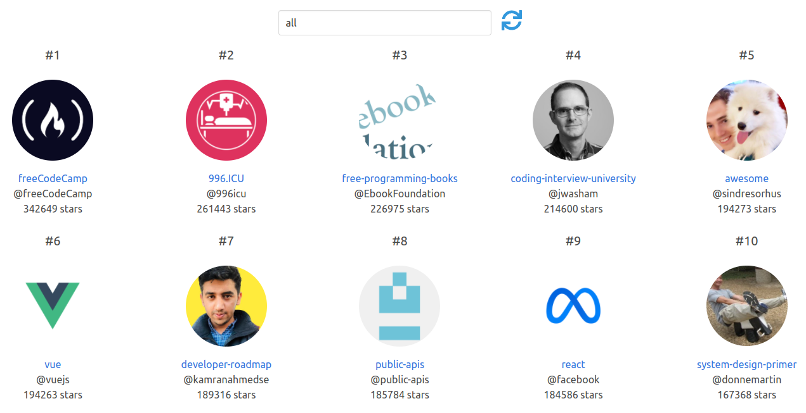

# GitHub Battle

GitHub Battle Clone with Vue.js and GraphQL

## Screenshot(s)

### Popular Repos


## Features

### Battle
* Enter in two Github usernames, and it'll declare a winner.
* Validate each username entered with the GitHub API to make sure they exist.
* user score = (3 * nb_followers) + nb_stars_for_his_repos
* show each user's info
  * avatar
  * username
  * full name
  * location
  * followers count
  * following count
  * public repos count
  * blog url

### Popular Repos
* View a list of popular repos.
  * filter by language(s)
    * all languages
    * or type a language (JavaScript, Java, Python, etc.)
  * sort results by stars in descending order
  * show each repo's info
    * name
    * link to the repo
    * owner
      * name
      * avatar
    * star count

## Why do we need a Backend/Web Server?

In order to protect the GitHub API key(s) in the production environment,
the API calls are done with the help of a backend/web server.
Unlike in the frontend, we can hide the API token(s) in the backend.

## Frontend Setup
```
npm install
```

### Compiles and hot-reloads for development
```
npm run serve
```

### Deployment

Create your project in the Firebase console.

#### Install the Firebase CLI

`npm install -g firebase-tools`

#### Login to Firebase.

`firebase login`

#### Build the app for production

`npm run build`

#### Initialize Firebase Project

`firebase init`

#### Deploy the app

`firebase deploy`

## Backend Setup

* Create an **Express** Project on [Glitch](https://glitch.com/)
  * [Example Project](https://glitch.com/~github-battle-backend)
* Add your **GitHub API Token** in the `.env` file.
* Add these dependencies in the `package.json` file:
  * cors
  * body-parser
  * axios
* Create a new route to serve as an intermediate between the frontend and the GitHub API, as shown below.

### Backend API Route Example Code

```javascript
app.post("/api", async (req, res) => {
  let config = {
    "headers": { "Authorization": `Token ${process.env.GITHUB_API_TOKEN}` }
  };
  let response = await axios.post("https://api.github.com/graphql", { "query": req.body.query }, config);
  res.json(response.data);
});
```

### Customize configuration
See [Configuration Reference](https://cli.vuejs.org/config/).

## Reference
[React Fundamentals](https://github.com/tylermcginnis/react-fundamentals)
